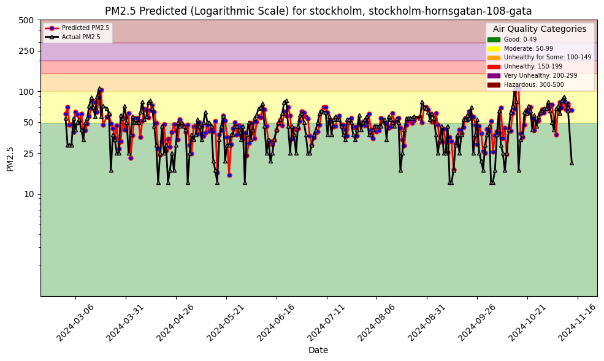
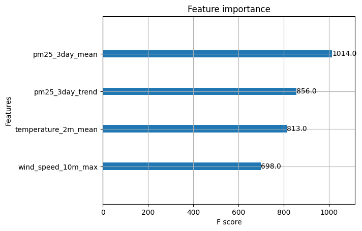

# Air Quality Analysis Project

This project, Lab 1 from KTH's ID2223 course in Scalable Machine Learning and Deep Learning, is inspired by the O'Reilly book "Building Machine Learning Systems with a Feature Store: Batch, Real-Time, and LLMs". It aims to analyze air quality data from a given location and provide insights using machine learning models. The project includes data retrieval, feature engineering, model training, and batch inference.

## Setup

1. Clone the repository:
    ```sh
    git clone https://github.com/yourusername/air-quality-analysis.git
    cd air-quality-analysis/notebooks/
    ```

2. Install the required dependencies:
    ```sh
    python3 -m venv .venv && \
    source .venv/bin/activate && \
    pip install -r requirements.txt
    ```

3. Set up your Hopsworks API key:
    - Save your Hopsworks API key in `data/hopsworks-api-key.txt`.

4. Set up your Aqi API Key:
    - Save your Aqi API key in `data/aqi-api-key.txt`.

## Usage

### Quality Feature Backfill

Create feature groups and backfill them with historical air quality data running the notebook `1_air_quality_feature_backfill.ipynb`.

#### Point 6. Add new features to add predictive power to the model.

* To the air _quality feature group_:
    1. Mean of the pm25 for the previous three days.
    2. Upwards or Downwards trend of the pm25 for the previous three days. This as to be calculated as the delta of the line fitting the three data points (x: df index, y: pm25)

* To the _weather feature group_:
    1. Seasonality feature


### Quality Feature Pipeline

The notebook `2_air_quality_feature_pipeline.ipynb` retrieves daily updates and inserts them into the two feature groups previously created. The feature pipeline will be scheduled to run once per day on GitHub Actions.

#### Point 6. Add the additional features to the daily retrieved data. 

1. PM25 mean.
2. Upwards/downwards PM25 trend.
3. Seasonality.


### Quality Training Pipeline

Train the air quality prediction model using the notebook `3_air_quality_training_pipeline.ipynb`.

#### Point 6. Update the feature view and train a newer version of the model. 

* New model input schema including the three newly introduced features.
* Gained higher accuracy on our predictions:

* Relevant is the importance of the new features:


### Batch Inference

Perform batch inference using the notebook `4_air_quality_batch_inference.ipynb`.

#### Point 6. Make predictions on a three days rolling window.

1. **Initialize the Air Quality Data**:
   Begin by preparing the air quality batch dataset for merging with the weather forecast batch dataset.

2. **Merge and Reorder Datasets**:
   Join the air quality and weather datasets using the `city` column as the key. Ensure the rows are ordered by date and rearrange the columns to match the format used in the training data.

3. **Combine DataFrames**:
   Stack the `last_three_day` DataFrame on top of the `batch_data` DataFrame to facilitate the calculation of PM25 features based on the previous three days. Once combined, reset the index of the `batch_data` DataFrame. This process prepares a complete batch of data for inference.

4. **Adjust Predictions Based on Index**:
   When generating predictions, consider the row index of the DataFrame:
   * **Index < 3**: Replace predicted `pm25` values with actual `pm25` values (backfill).
   * **Index == 3**: Generate a prediction for the next day.
   * **Index > 3**: Update the `pm25_3day_mean` and `pm25_3day_trend` features and continue predicting for subsequent days.


## License

This project is licensed under the Apache License 2.0. See the `LICENSE` file for details.